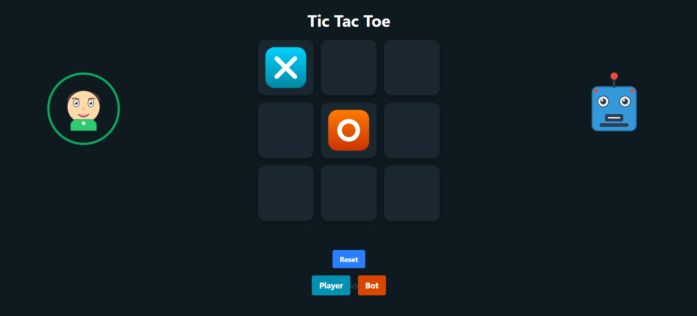

# 🎮 Tic-Tac-Toe Game with Minimax AI

A simple implementation of the classic Tic-Tac-Toe game where you can play against an unbeatable AI powered by the **Minimax algorithm**.

## 🚀 Features

- Classic 3x3 Tic-Tac-Toe board
- Play as **X** or **O**
- Intelligent AI using Minimax algorithm
- Built with clean and readable code

## 🧠 What is Minimax?

Minimax is a decision-making algorithm used in two-player games like Tic-Tac-Toe. It assumes both players play optimally and recursively evaluates all possible game states to choose the best move.

## 🛠️ Tech Stack

- **Language**: JavaScript 
- **Frontend**: React,TailwindCSS
- **Logic**: Minimax Algorithm

## 📦 How to Run

1. Clone the repo  
   ```bash
   git clone https://github.com/Umesh-Tummepalli/smart_tic-tac-toe.git
2. Install Dependencies
   ```bash
   npm install
3. Run the Project  
   ```bash
   npm run dev


## Preview



