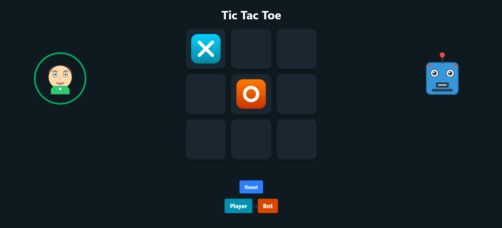
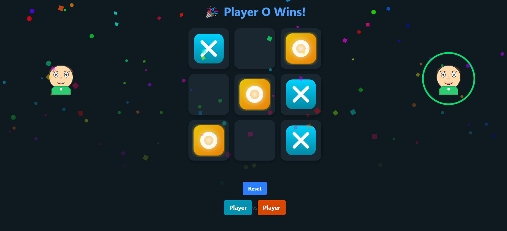
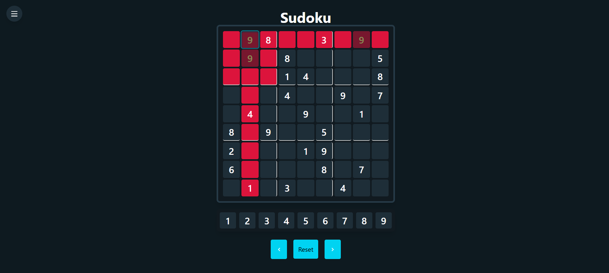

# 🎮 Smart Playground: Tic-Tac-Toe + Sudoku

A collection of smart games built with React — including an unbeatable Tic-Tac-Toe AI and an interactive Sudoku board with multiple difficulty levels!

## 🚀 Features

### Tic-Tac-Toe
* Classic 3x3 board.
* Play as **X** or **O**.
* **Unbeatable AI** using the **Minimax algorithm**.
* Clean and intuitive design.

### Sudoku
* Fully playable **Sudoku board**.
* **Difficulty Levels**: Easy, Medium, Hard, Expert, Master, Extreme.
* Each difficulty has **5 unique puzzles**.
* **Live Error Highlighting**:
   * Wrong moves are shown in **red** immediately.
   * Cells with conflicts are **dimmed** with animated low opacity.
* Smooth and responsive user experience.

### General
* **Landing Page** with navigation to each game.
* **Fully Responsive** and clean UI.
* Built with **React** and **TailwindCSS**.

## 🧠 What is Minimax?

Minimax is a decision-making algorithm used in two-player games like Tic-Tac-Toe. It simulates all possible moves assuming optimal play from both sides to choose the best move.

## 🛠️ Tech Stack

* **Frontend**: React.js, TailwindCSS
* **Logic**: JavaScript, Minimax Algorithm (for Tic Tac Toe), Sudoku Solver/Validator (for Sudoku)

## 📦 How to Run Locally

1. Clone the repo

```bash
git clone https://github.com/Umesh-Tummepalli/smart_playground.git
```

2. Install dependencies

```bash
npm install
```

3. Start the development server

```bash
npm run dev
```

## 📸 Preview

**Landing Page:** 

**Tic Tac Toe:** 


**Sudoku Game:** 

## ✨ Future Enhancements

* Timer and Hint system for Sudoku.
* Dark/Light Theme switcher.
* Add more classic games!